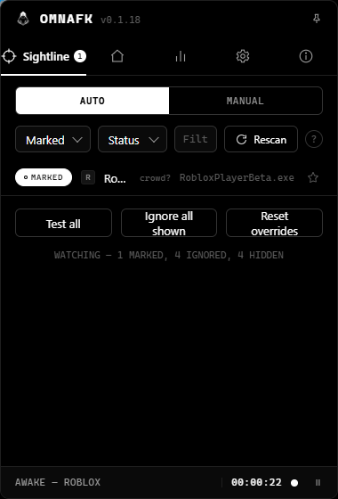
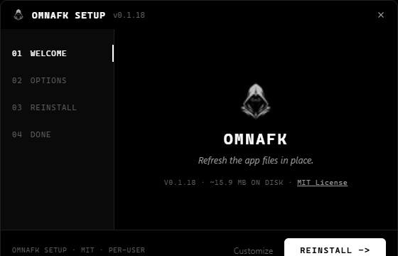

<p align="center">
  
</p>

<p align="center">
  <strong>A quiet Windows tray watcher that keeps any game awake.</strong>
</p>

<p align="center">
  <a href="https://github.com/OMNHZN/OMNAFK/releases/latest"><strong>Download for Windows</strong></a>
  ·
  <a href="https://omnhzn.github.io/OMNAFK/">Website</a>
  ·
  <a href="docs/GUIDE.md">User guide</a>
  ·
  <a href="docs/TROUBLESHOOTING.md">Troubleshooting</a>
  ·
  <a href="https://github.com/OMNHZN/OMNAFK/issues/new?template=bug_report.yml">Report a bug</a>
</p>

<p align="center">
  <a href="https://github.com/OMNHZN/OMNAFK/releases">
    
  </a>
  <a href="https://github.com/OMNHZN/OMNAFK/actions/workflows/release.yml">
    
  </a>
  
  <a href="LICENSE">
    
  </a>
</p>

## What It Does

OMNAFK watches your visible windows, marks the ones that look like games, and keeps **any game** awake without asking you to babysit another control panel. There is no arm button and no start button. Install it, launch a game, and it handles the rest — including restarting elevated when a game requires it.

## Highlights

- Sightline detects fullscreen, borderless, and game-platform windows automatically.
- Star important Sightline targets so they stay at the top of the list.
- A first-run walkthrough explains Sightline, keepalive timing, safety controls, and where to replay the guide.
- Target details explain why a window was marked and show adaptive action progress.
- Presence details can show when supported games look in session, at a menu, or held.
- Sends real keyboard/mouse input (`SendInput`) so keepalives work in virtually every game.
- Optional virtual-gamepad nudges (via ViGEmBus) keep controller-gated games awake; controller activity also pauses keepalives while you play. See [docs/GAMEPAD.md](docs/GAMEPAD.md).
- Restarts elevated automatically when a game runs as administrator (UAC prompt once).
- Ships built-in profiles for dozens of games (GTA V, Minecraft, Fortnite, Valorant, CS2, platform titles, and more).
- Learns your movement keys quickly (20 samples) and switches to adaptive keepalives per game.
- Test all active targets before you step away.
- Optional community profiles can add shared detection hints and proven settings.
- Skips ticks only for the focused game while there is recent user input, so it stays out of your way while you are playing without starving background targets.
- Can move marked games to a preferred monitor, with per-target overrides and placement status.
- Force-mark or ignore unusual windows with executable and title rules.
- Includes dark and high-contrast interface themes.
- The tray menu shows current state, target counts, and the next scheduled tick at a glance.
- Native Windows notifications are used when the flyout is closed, while in-flyout notices keep their action buttons.
- Update prompts can notify, wait for manual action, or install stable updates automatically on launch when OMNAFK is idle.
- Control the running app from a script or Stream Deck by relaunching the exe with `--suspend`, `--resume`, `--toggle-suspend`, `--snooze <minutes>`, or `--rescan`.
- Saves settings and target marks immediately.
- Checks stable releases and opens bug reports from Settings.

## Install

Download `OMNAFK-Setup.exe` from the [latest release](https://github.com/OMNHZN/OMNAFK/releases/latest), run it, and leave **Start with Windows** enabled if you want OMNAFK to live quietly in the tray.

## Updates And Feedback

The app is connected to [OMNHZN/OMNAFK](https://github.com/OMNHZN/OMNAFK). The Settings tab can check releases, install stable updates, open the repository, and start a bug report.

New stable version tags, such as `v0.1.18`, build and attach the custom setup executable to GitHub Releases.

<details>
<summary>Screenshots</summary>

<table>
  <tr>
    <td width="50%">
      
      <br>
      <sub>Tray flyout</sub>
    </td>
    <td width="50%">
      
      <br>
      <sub>Custom setup</sub>
    </td>
  </tr>
</table>

</details>

<details>
<summary>Build from source</summary>

```powershell
cd src-tauri
cargo test
cargo clippy --all-targets -- -D warnings
cargo tauri build
cd ..
.\scripts\build-custom-installer.ps1
```

Local installer builds are written to `dist\OMNAFK-Setup.exe`.

</details>

<details>
<summary>Release checklist</summary>

```powershell
git tag v0.1.18
git push origin main
git push origin v0.1.18
```

GitHub Actions builds the Windows installer and publishes it to GitHub Releases. See [docs/RELEASING.md](docs/RELEASING.md) for the full release checklist.

</details>

## Help

New users can start with the [user guide](docs/GUIDE.md). Common detection, setup, tray, and update fixes live in [Troubleshooting](docs/TROUBLESHOOTING.md). For game detection reports, installer problems, update issues, or community profile suggestions, open the matching template from the [Issues](https://github.com/OMNHZN/OMNAFK/issues/new/choose) page.

## Changelog

See [CHANGELOG.md](CHANGELOG.md) for stable release notes.

## Safety Note

Sending automated input may violate the terms of service of some games or platforms. Use OMNAFK at your own discretion.

## License

MIT. See [LICENSE](LICENSE).

